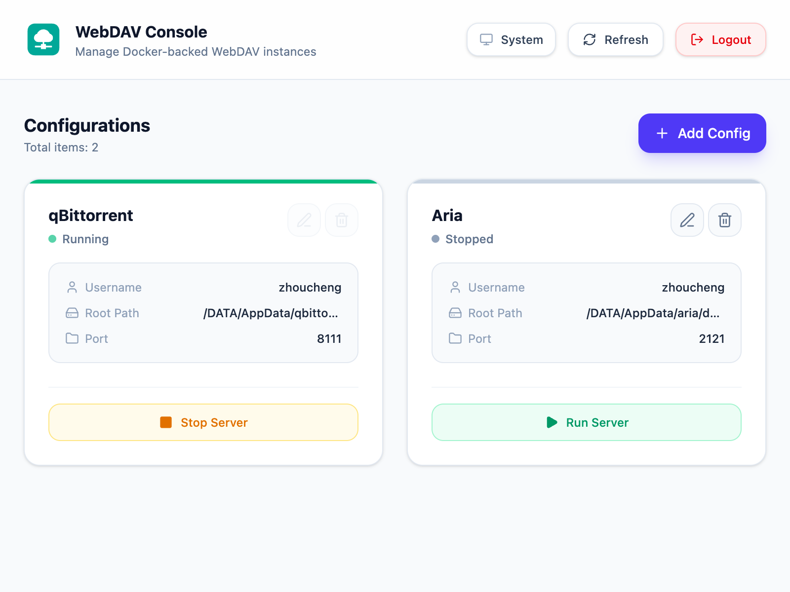

# WebDAV Docker Management Panel

</img>


[**DAV Server**](https://github.com/Zhoucheng133/DAV-Server) | **★ DAV Docker**

A modern WebDAV service management panel built with Go (Fiber) and React (Vite + Tailwind). It allows you to easily create, configure, start, and stop multiple independent WebDAV service instances through a visualized web interface and manage local directories efficiently.

## 📸 Preview



## 🌟 Features

- **Visual Web UI**: Easily add, edit, delete, and control multiple WebDAV services.
- **Multi-Instance Support**: Flexibly configure different ports, directory mounts, and access permissions for each instance.
- **Modern Interface**: Built with React, featuring responsive layout, dark mode toggle, and secure authentication.
- **Lightweight Deployment**: Built with Go and Alpine Linux, ensuring a minimal image size and low resource consumption.

---

## 🚀 Quick Installation & Deployment

Deploying via **Docker** is strongly recommended:

```bash
sudo docker run -d \
  --restart always \
  -v <YOUR_HOST_DATA_DIR>:<YOUR_CONTAINER_DATA_DIR> \
  -v <YOUR_HOST_CONFIG_DIR>:/app/db \
  -e WEBUI=<YOUR_WEBUI_PORT> \
  --network host \
  --name dav \
  zhouc1230/webdav:latest
```

> ⚠️ **Important Notes on Mount Paths:**
> - **Path Mapping**: The left side of `-v` is your host path and the right side is the container path (e.g., `-v /mnt/disk:/DATA`). The application accesses files through the container path, so you need to convert and use the corresponding container path when configuring your WebDAV instances in the panel. (Tip: Keeping both sides identical, such as `-v /DATA:/DATA`, makes path mapping much simpler and easier to manage).
> - **Security Warning**: **Do NOT** mount sensitive system paths (such as `/`, `/etc`, `/root`, etc.). Only mount specific data directories (e.g., `/home/user/data` or `/DATA`) to prevent security risks.

### Parameter Description

| Parameter | Description |
| :--- | :--- |
| `-v <YOUR_HOST_DATA_DIR>:<YOUR_CONTAINER_DATA_DIR>` | Mounts your host data directory into the container (e.g., `-v /DATA:/DATA`). |
| `-v <YOUR_HOST_CONFIG_DIR>:/app/db` | Persists the application database and configuration files (e.g., `-v /DATA/AppData/dav:/app/db`). |
| `-e WEBUI=<YOUR_WEBUI_PORT>` | Specifies the port for the Web management panel (defaults to `3000` if omitted; e.g., `-e WEBUI=2211`). |
| `--network host` | Uses host networking mode (convenient for binding multiple instance ports). |
| `--name dav` | Assigns a name to the Docker container. |

---

## 🔄 Updating the Container / Image

To update to the latest version of the WebDAV panel, run the following commands:

```bash
# 1. Stop and remove the existing container
sudo docker stop dav && sudo docker rm dav

# 2. Pull the latest image
sudo docker pull zhouc1230/webdav:latest

# 3. Re-run the container using your deployment command
sudo docker run -d \
  --restart always \
  -v <YOUR_HOST_DATA_DIR>:<YOUR_CONTAINER_DATA_DIR> \
  -v <YOUR_HOST_CONFIG_DIR>:/app/db \
  -e WEBUI=<YOUR_WEBUI_PORT> \
  --network host \
  --name dav \
  zhouc1230/webdav:latest
```

---

## 💻 Access & Usage

1. Once deployed, open your browser and visit `http://<your-server-ip>:<YOUR_WEBUI_PORT>` (e.g., `http://<your-server-ip>:2211`).
2. Follow the on-screen instructions upon your first visit to register and log in to your administrator account.
3. Configure and start your WebDAV services directly from the dashboard.

---

## 🛠️ Local Development & Building

If you wish to contribute or build from source:

### Requirements
- Go 1.25+
- Bun / Node.js

### Build Docker Image
```bash
docker build -t zhouc1230/webdav:latest -f dockerfile .
```

---

## 📄 License

This project is open-sourced under the [MIT License](LICENSE).
