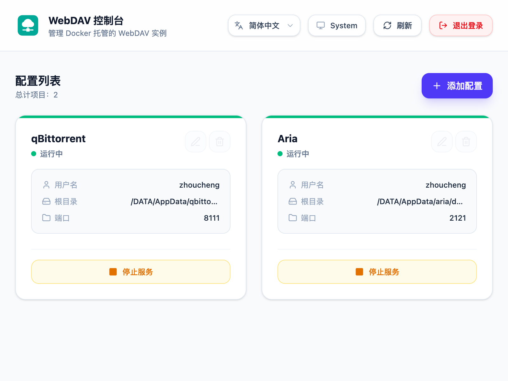

# WebDAV Docker

</img>


[**DAV Server**](https://github.com/Zhoucheng133/DAV-Server) | **★ DAV Docker**

一个基于 Go (Fiber) 和 React (Vite + Tailwind) 构建的现代化 WebDAV 服务管理面板。你可以通过可视化 Web 界面轻松创建、配置、启动和停止多个独立的 WebDAV 服务实例，并高效管理本地目录。

## 📸 预览



## 🌟 特性

- **可视化 Web 界面**：轻松添加、编辑、删除并控制多个 WebDAV 服务。
- **多实例支持**：可灵活为每个实例配置不同的端口、目录挂载和访问权限。
- **现代化界面**：基于 React 构建，支持响应式布局、深色模式切换和安全认证。
- **轻量级部署**：基于 Go 和 Alpine Linux 构建，镜像体积小、资源占用低。

---

## 🚀 快速安装与部署

强烈推荐通过 **Docker** 部署：

```bash
sudo docker run -d \
  --restart always \
  -v <YOUR_HOST_DATA_DIR>:<YOUR_CONTAINER_DATA_DIR> \
  -v <YOUR_HOST_CONFIG_DIR>:/app/db \
  -e WEBUI=<YOUR_WEBUI_PORT> \
  --network host \
  --name dav \
  zhouc1230/webdav:latest
```

> ⚠️ **挂载路径重要说明：**
> - **路径映射**：`-v` 左侧为宿主机路径，右侧为容器路径（例如 `-v /mnt/disk:/DATA`）。应用程序通过容器路径访问文件，因此在面板中配置 WebDAV 实例时，需要转换并使用相应的容器路径。（提示：让两侧路径保持一致，例如 `-v /DATA:/DATA`，可使路径映射更简单、更易管理）。
> - **安全警告**：**切勿**挂载敏感的系统路径（如 `/`、`/etc`、`/root` 等），仅挂载特定的数据目录（如 `/home/user/data` 或 `/DATA`），以避免安全风险。

### 参数说明

| 参数 | 说明 |
| :--- | :--- |
| `-v <YOUR_HOST_DATA_DIR>:<YOUR_CONTAINER_DATA_DIR>` | 将宿主机数据目录挂载到容器内（例如 `-v /DATA:/DATA`）。 |
| `-v <YOUR_HOST_CONFIG_DIR>:/app/db` | 持久化应用数据库和配置文件（例如 `-v /DATA/AppData/dav:/app/db`）。 |
| `-e WEBUI=<YOUR_WEBUI_PORT>` | 指定 Web 管理面板端口（省略时默认为 `3000`；例如 `-e WEBUI=2211`）。 |
| `--network host` | 使用宿主机网络模式（便于绑定多个实例端口）。 |
| `--name dav` | 为 Docker 容器指定名称。 |

---

### 示例

```bash
sudo docker run -d \
--restart always \
-v /DATA:/DATA \
-v /DATA/AppData/dav:/app/db \
-e WEBUI=2211 \
--network host \
--name dav \
zhouc1230/webdav:latest
```
| 参数 | 说明 |
| :--- | :--- |
|`WebUI`|<server_ip>:2211|
|`Database Dir`|`/DATA/AppData/dav`|


## 🔄 更新容器 / 镜像

要更新到最新版本的 WebDAV 面板，请执行以下命令：

```bash
# 1. 停止并删除现有容器
sudo docker stop dav && sudo docker rm dav

# 2. 拉取最新镜像
sudo docker pull zhouc1230/webdav:latest

# 3. 使用你的部署命令重新运行容器
sudo docker run -d \
  --restart always \
  -v <YOUR_HOST_DATA_DIR>:<YOUR_CONTAINER_DATA_DIR> \
  -v <YOUR_HOST_CONFIG_DIR>:/app/db \
  -e WEBUI=<YOUR_WEBUI_PORT> \
  --network host \
  --name dav \
  zhouc1230/webdav:latest
```

---

## 💻 访问与使用

1. 部署完成后，打开浏览器访问 `http://<your-server-ip>:<YOUR_WEBUI_PORT>`（例如 `http://<your-server-ip>:2211`）。
2. 首次访问时，按照屏幕提示注册并登录管理员账户。
3. 直接在控制面板中配置并启动你的 WebDAV 服务。

---

## 🛠️ 本地开发与构建

如果你想参与贡献或从源码构建：

### 环境要求
- Go 1.25+
- Bun / Node.js

### 构建 Docker 镜像
```bash
docker build -t zhouc1230/webdav:latest -f dockerfile .
```

---

## 📄 许可证

本项目基于 [MIT 许可证](./LICENSE) 开源。
